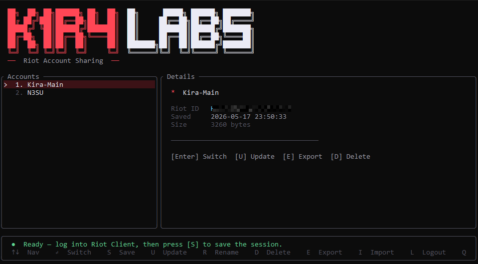

<div align="center">

<pre style="font-family:monospace; text-align:center;">
██   ██  ██ ██████  ██   ██ ██       █████  ██████  ███████ 
██  ██  ███ ██   ██ ██   ██ ██      ██   ██ ██   ██ ██      
█████    ██ ██████  ███████ ██      ███████ ██████  ███████ 
██  ██   ██ ██   ██      ██ ██      ██   ██ ██   ██      ██ 
██   ██  ██ ██   ██      ██ ███████ ██   ██ ██████  ███████ 
                                                            
                                                            
</pre>

🌐 &nbsp;[English](../README.md) · [Español](README.es.md) · [Português](README.pt.md)

<br/>

### Riot Account Switcher

**Partagez votre compte Riot sans partager votre mot de passe — changez de compte en un instant.**  
Pas de navigateur, pas d'édition manuelle de fichiers — appuyez simplement sur `Enter`.

<br/>

[](https://github.com/Kira-Kohler/riot-account-switcher/releases/latest)&nbsp;
[](https://github.com/Kira-Kohler/riot-account-switcher/releases)&nbsp;
[](https://www.rust-lang.org)&nbsp;
[](../LICENSE)

<br/>

> ⚡ Changement de compte en ~2 secondes &nbsp;|&nbsp; 🔒 Exports chiffrés AES-256-GCM &nbsp;|&nbsp; 📦 Un seul `.exe` portable

<br/>



</div>

---

## Pourquoi

Gérer plusieurs comptes League of Legends, VALORANT ou TFT implique de se déconnecter constamment, d'attendre le rechargement du client Riot et de saisir des mots de passe. Cet outil rend le changement de compte **instantané** en échangeant directement le fichier de session du client Riot — aucune information d'identification requise après le premier enregistrement.

---

## ✨ Fonctionnalités

| | Fonction | Description |
|---|---|---|
| ⚡ | **Changement instantané** | Ferme le client Riot, échange la session, relance en ~2s |
| 🎮 | **Détection du Riot ID** | Lit `gameName#TAG` en direct depuis l'API locale du client Riot |
| 🔒 | **Exports chiffrés** | Partagez des comptes via des fichiers `.riotacc` (AES-256-GCM, nom masqué) |
| 💾 | **Stockage local uniquement** | Sessions stockées en SQLite — jamais envoyées nulle part |
| 🚪 | **Raccourci de déconnexion** | Efface la session et relance le client Riot à l'écran de connexion |
| 📂 | **Boîte de dialogue native** | Intégration à l'Explorateur Windows pour importer des fichiers `.riotacc` |
| 🛡️ | **Élévation UAC** | Demande les droits administrateur automatiquement via un manifeste intégré |
| 📦 | **Zéro dépendance** | Un seul `.exe` portable, pas d'installateur, pas de dépendances |

---

## 🚀 Démarrage rapide

### Téléchargement (recommandé)

1. Rendez-vous sur [**Releases**](https://github.com/Kira-Kohler/riot-account-switcher/releases/latest)
2. Téléchargez `K1R4LABS-RiotAccSwitcher.exe`
3. Placez-le où vous voulez
4. Exécutez-le (une demande UAC apparaîtra — c'est attendu)

### Compiler depuis les sources

```powershell
git clone https://github.com/Kira-Kohler/riot-account-switcher
cd riot-account-switcher
cargo build --release
```

> Nécessite [Rust](https://rustup.rs) avec la chaîne d'outils `x86_64-pc-windows-msvc`.  
> Résultat : `target\release\K1R4LABS-RiotAccSwitcher.exe`

---

## 🎮 Utilisation

### Raccourcis clavier

| Touche | Action |
|--------|--------|
| `↑` / `↓` | Naviguer dans la liste des comptes |
| `Enter` | Basculer vers le compte sélectionné |
| `S` | Enregistrer la session actuelle du client Riot |
| `U` | Mettre à jour les tokens + Riot ID du compte sélectionné |
| `R` | Renommer le compte sélectionné |
| `D` | Supprimer le compte sélectionné |
| `E` | Exporter vers un fichier `.riotacc` chiffré |
| `I` | Importer depuis un fichier `.riotacc` |
| `L` | Déconnexion — efface la session et affiche l'écran de connexion |
| `Q` | Quitter |

### Flux de travail typique

```
1. Connectez-vous à votre premier compte via le client Riot
2. Ouvrez K1R4LABS-RiotAccSwitcher
3. Appuyez sur [S] et donnez un nom au compte  →  enregistré !
4. Répétez pour chaque compte
5. Sélectionnez un compte et appuyez sur [Enter] pour basculer instantanément
```

---

<details>
<summary>📁 Exporter / Importer (fichiers .riotacc)</summary>

<br/>

Exporter un compte pour le partager ou le sauvegarder :

1. Sélectionnez le compte et appuyez sur `[E]`
2. Entrez un mot de passe pour protéger le fichier
3. Un fichier `.riotacc` est créé à côté de l'exécutable

Importer sur n'importe quelle machine :

1. Appuyez sur `[I]` — une boîte de dialogue Windows s'ouvre
2. Sélectionnez le fichier `.riotacc`
3. Entrez le mot de passe

**Sécurité :** Le nom du compte et les données de session sont tous deux chiffrés à l'intérieur du fichier. L'enveloppe JSON ne contient que `v`, `salt`, `nonce` et `ciphertext` — rien en clair.

```json
{
  "v": 2,
  "salt": "<base64 — 16 octets aléatoires>",
  "nonce": "<base64 — 12 octets aléatoires>",
  "ciphertext": "<base64 — AES-256-GCM chiffré {name, data}>"
}
```

Dérivation de clé : **PBKDF2-HMAC-SHA256** · 100 000 itérations · sel aléatoire de 16 octets

</details>

<details>
<summary>🏗️ Architecture</summary>

<br/>

```
src/
├── main.rs     Point d'entrée — ouvre la BD, lance l'interface TUI
├── ui.rs       TUI complète : mise en page, rendu, gestion des entrées et état
├── riot.rs     Intégration avec le client Riot
│               ├── Lecture / écriture du YAML de session
│               ├── Requêtes à l'API locale via lockfile (Riot ID)
│               └── Gestion des processus (tuer / lancer)
├── db.rs       Persistance SQLite via rusqlite
└── crypto.rs   Export/import AES-256-GCM — nom chiffré dans le ciphertext

assets/
├── K1R4LABS.ico    Icône de l'application (intégrée dans le binaire)
└── Preview.png     Capture d'écran

build.rs        winresource — intègre l'icône, le manifeste UAC et les métadonnées
```

**Emplacement du fichier de session :**
```
%LOCALAPPDATA%\Riot Games\Riot Client\Data\RiotGamesPrivateSettings.yaml
```

**Source du Riot ID :**
```
%LOCALAPPDATA%\Riot Games\Riot Client\Config\lockfile
→ HTTPS GET https://127.0.0.1:{port}/riot-client-auth/v1/userinfo
```

</details>

---

## 🛡️ Sécurité

- Les sessions sont stockées **localement uniquement** — aucune requête réseau vers des serveurs externes
- La seule communication externe est avec `127.0.0.1` (le client Riot lui-même)
- Les exports `.riotacc` masquent le nom du compte — le fichier ne révèle rien sans le mot de passe
- **Ne partagez pas** votre `accounts.db` — il stocke toutes les sessions sans protection par mot de passe
- **Ne partagez les fichiers `.riotacc` qu'avec des personnes de confiance** — ils donnent un accès complet à ce compte

---

## 📋 Prérequis

- Windows 10 ou Windows 11
- [Client Riot Games](https://www.riotgames.com) installé
- Privilèges administrateur (demandés automatiquement)

---

## 🤝 Contribuer

Les issues et pull requests sont les bienvenues.  
Pour les changements importants, ouvrez d'abord une issue pour discuter de ce que vous souhaitez modifier.

---

## 📄 Licence

[MIT](../LICENSE) © 2026 K1R4LABS
